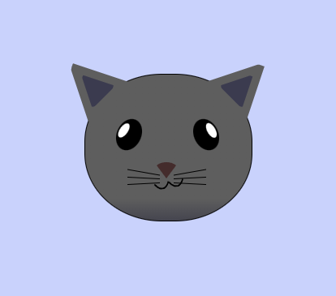

## Seletores CSS

- `*` → seletor universal  
- `.` → seletor de classe  
- `background: linear-gradient()` → plano de fundo com gradiente linear  

---

## Propriedade `position`

- `position: static` → `top`, `bottom`, `left` e `right` **INATIVOS**  
- `position: relative` → segue o fluxo normal do navegador. `top`, `bottom`, `left` e `right` **ATIVOS**  
- `position: absolute` → retirado do fluxo normal do documento, posição determinada por `top`, `right`, `bottom` e `left`  
- `position: fixed` → permite deixar um elemento fixo na página, independentemente da rolagem  
- `position: sticky` → híbrido de `relative` e `fixed`, permitindo que um elemento "grude" em uma posição específica com base na rolagem  

---

## Centralizar um elemento

```css
position: absolute;
top: 0;
left: 0;
right: 0;
bottom: 0;
margin: auto;
```

---

## Propriedade `transform`

Permite modificar a forma, posição e tamanho de um elemento sem afetar os elementos circundantes. Funções:

- `translate(x, y)` → Move o elemento nas direções X e Y  
- `rotate(angle)` → Rotaciona o elemento pelo ângulo especificado  
- `scale(x, y)` → Redimensiona o elemento nas direções X e Y  
- `skew(x, y)` → Inclina o elemento ao longo dos eixos X e Y  
- `matrix(a, b, c, d, e, f)` → Aplica uma transformação complexa combinada  

---

## Propriedade `z-index`

Controla a ordem de empilhamento dos elementos na tela.

- Aceita valores numéricos (inteiros positivos, negativos ou zero).  
- Elementos com valores maiores aparecem na frente dos elementos com valores menores.  
- Funciona apenas em elementos com `position` diferente de `static` (`relative`, `absolute`, `fixed` ou `sticky`).  

---


