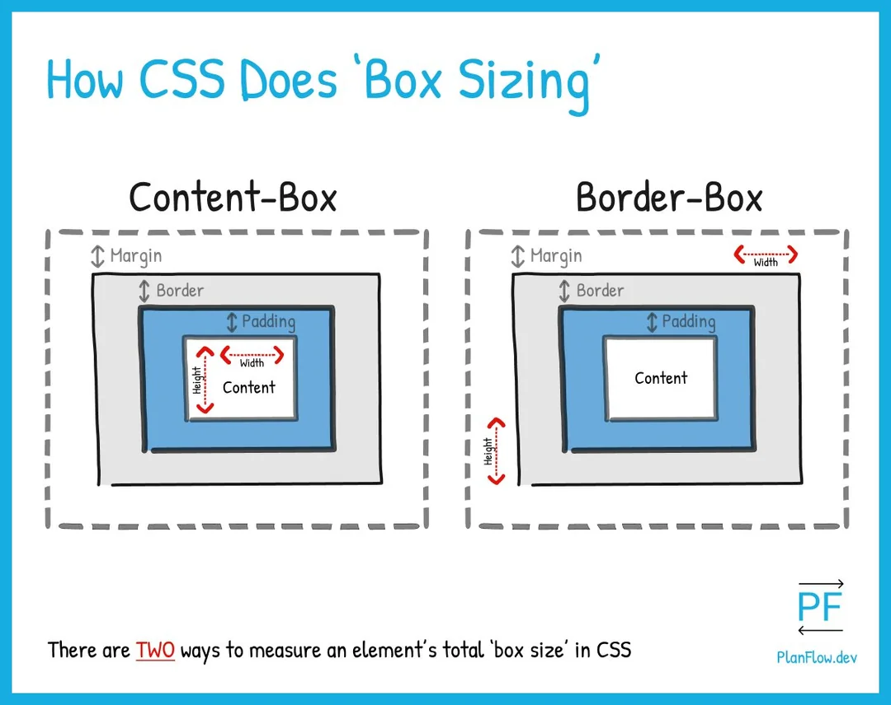

elementos :
    table --> caption, tbody e thead

box-sizing: border-box ---> define o tamanho incluindo as bordas,conteudo e preenchimento
,por padrao é box-sizing: content-box que define o tamanho apenas do conteudo do elemento

Padding --> espacamento\
border --> borda\
margin --> margem

https://planflow.dev/blog/what-is-box-sizing-in-css-how-does-it-work

span[class~="sr-only"] {\
    border: 0;\
    clip-path: inset(50);\
}\
    -->  código CSS acima usa técnicas para esconder visualmente o elemento, mas mantê-lo acessível para leitores de tela
    border: 0;

1 . border: 0; --> Remove qualquer borda ao redor do elemento (caso haja).

2 . clip: rect(1px, 1px, 1px, 1px); --> Recorta o elemento em um pequeno ponto de 1x1 pixels, tornando-o invisível.
Essa propriedade só funciona se position: absolute estiver definido.

3 . clip-path: inset(50%); --> Substitui clip e define um recorte que reduz o elemento para um pequeno retângulo invisível.